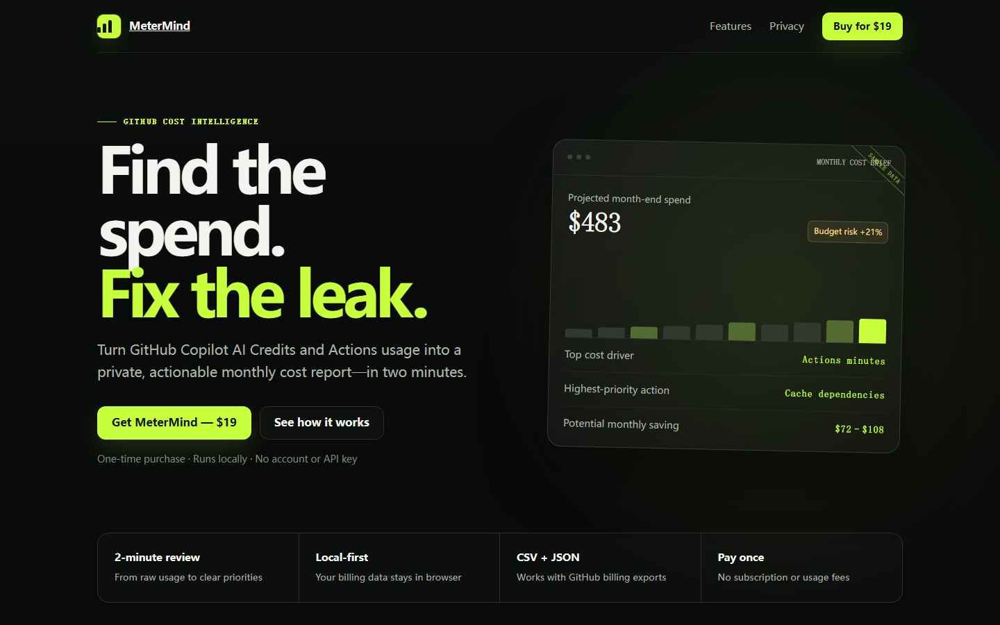

# MeterMind

**Find the spend. Fix the leak.**

MeterMind turns GitHub Copilot AI Credits and Actions usage into a private, actionable monthly cost report—in about two minutes.

[Visit the website](https://get-metermind.yuqih019.chatgpt.site/) · [Buy MeterMind for $19](https://checkout.dodopayments.com/buy/pdt_0NodEEQxSV6lKUDszrYqc?quantity=1) · [Report an issue](https://github.com/yuqih019-bomp/metermind/issues)

## The problem

GitHub billing exports show rows, minutes, SKUs, and credits. They do not tell you:

- where the month is heading;
- which workload is driving the bill;
- which optimization is worth doing first; or
- how much a practical change may save.

MeterMind turns that raw usage into a decision-ready brief.

## What you get

- Month-end spend projection
- Copilot vs. Actions cost split
- Ranked cost drivers
- Three prioritized saving opportunities
- Downloadable management brief
- CSV and JSON import
- Sample data and source code included with purchase

## Private by design

MeterMind runs locally in your browser. Your billing export is processed on your device—not uploaded to a MeterMind server.

- No account required to use the app
- No API key or cloud setup
- No recurring data connection
- No billing files stored on a server

## How it works

1. Export a GitHub billing CSV or usage API JSON file.
2. Drop it into MeterMind.
3. Review the forecast, cost drivers, and prioritized actions.

## Who it is for

- Indie developers watching Copilot and Actions spend
- Engineering leads who need a short monthly cost brief
- Small teams that want answers without deploying another SaaS dashboard

## Price

**$19 one time. No subscription.**

[Get MeterMind](https://checkout.dodopayments.com/buy/pdt_0NodEEQxSV6lKUDszrYqc?quantity=1)

## Feedback and support

Use [GitHub Issues](https://github.com/yuqih019-bomp/metermind/issues) for product questions, bug reports, and feature requests.

This repository is the public product page and issue tracker. The commercial application is delivered after purchase.

---

© 2026 MeterMind. All rights reserved.
